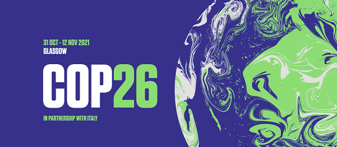

# COP26 Radar

## Description

I had the chance to attend the 2 weeks of the COP26 as a volunteer of the Fresque du Climat to educate in the street as well as in the blue zone about climate issues. Between the grandiloquent announcements of countries and companies and the suffering shouted in the climate marches, it is difficult to understand the extent of the reactions to these 2 weeks of conferences in Glasgow. 

Many media covered the failure of the COP and the negotiations, but it is still difficult to quantify how people reacted, what their emotions were, which topics really marked them - the greenwashing attempts of the companies or the moving speeches of Vanessa Nakate and other activists. 

!!! warning "Experimental"
    This work is still under active development
    Don't expect everything to be finished
    Please contact [me](mailto:theo.alves.da.costa@gmail.com) if you have any question

## Contributors
- [Théo Alves Da Costa](mailto:theo.alves.da.costa@gmail.com)